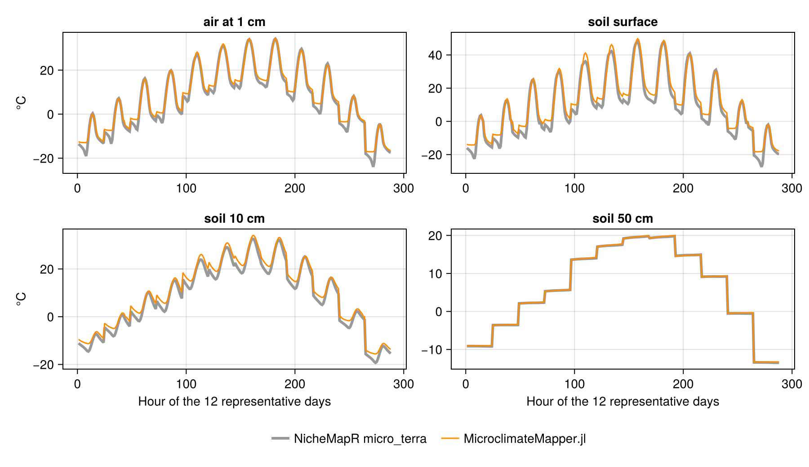

# For NicheMapR users

NicheMapR has one function for each data set: `micro_global`, `micro_terra`, `micro_usa`, `micro_ncep`,
`micro_era5`, `micro_aust`, `micro_silo`, `micro_barra` and others. Each runs one point, with its own arguments
for that data set. Here there is one model, the data set is a keyword, and the same run works for one point,
many points or a grid.

## One keyword for each function

| NicheMapR | `weather_source` | What NicheMapR needed | What happens here |
|:--|:--|:--|:--|
| `micro_global` | `CRUCL2`, with `soil_moisture_source = CPCSoil` | the global climate database, downloaded once | the same CRU CL 2.0 grids, through RasterDataSources.jl |
| `micro_terra` | `TerraClimate{Historical}` | TerraClimate read over OPeNDAP | yearly files downloaded and cached |
| `micro_usa` | `GRIDMET` | gridMET read over OPeNDAP | yearly files downloaded and cached |
| `micro_ncep` | `NCEP` | RNCEP, and microclima for hourly forcing and terrain | NCEP files downloaded and cached; hourly forcing and terrain here |
| `micro_era5` | `ERA5`, `ERA5ECMWF` | grids downloaded beforehand with mcera5 | read on demand from Google's ARCO-ERA5 store, or from ECMWF's with a Copernicus key, see [Access](forcing_data.md#Access) |
| `micro_aust` | `AWAP` | AWAP grids | AWAP grids through RasterDataSources.jl; wind from `CRUCL2` as in NicheMapR |
| `micro_silo` | `SILO` | the SILO DataDrill | SILO through RasterDataSources.jl or point queries; wind from `CRUCL2` |
| `micro_barra` | `BARRA` | BARRA2 over OPeNDAP | the same server, through RasterDataSources.jl |

Terrain in NicheMapR came from elevatr and microclima when `dem` or `terrain` was set. Here every run has a
`dem_source`, from which slope, aspect and horizon angles are computed with Geomorphometry.jl, and the weather
is corrected for the difference between the DEM and the weather grid's own elevation, see
[Terrain and atmosphere](terrain.md).

`micro_uk` (CHESS), `micro_nz` (VCSN), `micro_openmeteo` and `micro_access_s2` have no counterpart yet. Each is a
new data-set type and about twenty lines here, see
[One keyword per data set](data_sources.md#Adding-a-data-set).

## Arguments

| NicheMapR | Here |
|:--|:--|
| `loc` | `points` of a [`MicroVectorProblem`](@ref), or [`geocode`](@ref) for a place name |
| `dstart`, `dfinish`, `ystart`, `yfinish`, `nyears` | `dates`, any range of `Date`s |
| `timeinterval` | set by the data set: 12 representative days for a monthly source, every day for a daily one |
| `DEP` | `depths` of the `MicroModel`, any number, with units |
| `Usrhyt` | `heights` of the `MicroModel`, any number, with units |
| `REFL` | `surface_albedo_source`: a number, a raster, a data set, or land-cover classes |
| `RUF` | `roughness_height_source`, in the same forms |
| `slope`, `aspect`, `hori` | computed from `dem_source` for each point or cell |
| `elev` | from `dem_source`, or `data = (; dem = raster)` |
| `soilgrids = 1` | [`build_soil_profile`](@ref)`(SoilGrids, point)` |
| `runmoist` | the `soil_moisture_strategy` of the `MicroModel`'s configuration |
| `snowmodel` | `snow_model = SnowModel()` or `NoSnow()` |
| `run.gads` | the aerosol model, see [Terrain and atmosphere](terrain.md) |
| `lapse_max`, `lapse_min` | `lapse_rate_model` of the [`MicroMapModel`](@ref) |
| `minshade`, `maxshade` | a shade value, or a multilayer canopy, see Microclimate.jl's [Canopy](https://biophysicalecology.github.io/Microclimate.jl/dev/manual/canopy) |

The physical parameters of soil and snow, such as `Thcond`, `SpecHeat`, `Density`, `BulkDensity` and the
Campbell parameters `PE`, `KS` and `BB`, belong to the `MicroModel` and `SoilProfile` of Microclimate.jl, see its
[Configuring the model](https://biophysicalecology.github.io/Microclimate.jl/dev/manual/configuring_the_model).

## Outputs

NicheMapR returns matrices with one row per hour: `metout` and `shadmet` for the air, `soil` and `shadsoil` for
soil temperature, `soilmoist`, `humid`, `soilpot`, `sunsnow` and others. Here `solve` returns one `RasterStack`
whose layers have named dimensions: `point` (or `X` and `Y`), `Ti`, and `depth` or `height` where they apply, see
[Outputs](outputs.md). The soil temperature at 10 cm at the second point is
`output.soil_temperature[point = 2, depth = Near(0.1)]`, not a column number. Shade is a second run with a
different shade or canopy, not a second set of outputs.

## How closely they agree

The point model is Microclimate.jl, which is tested against the NicheMapR Fortran, see its
[Introduction](https://biophysicalecology.github.io/Microclimate.jl/dev/manual/introduction). What can differ
here is the forcing: how each data set is read, interpolated to the point, corrected for elevation and turned
into hourly values.

`micro_terra` at its default site, Madison, for 2000 (`test/R/micro_terra_test.R`), against the same run here
with `weather_source = TerraClimate{Historical}`, no snow and fixed soil moisture as in the R run:

| | RMSE (K) | Mean difference, here less NicheMapR (K) |
|:--|:--|:--|
| air at 1 cm | 1.9 | 1.11 |
| air at 1.2 m | 0.22 | −0.17 |
| soil surface | 3.65 | 2.43 |
| soil at 10 cm | 2.14 | 1.91 |
| soil at 50 cm | 0.1 | 0.07 |

Made by `docs/render/nichemapr.jl`; the R run has no organic surface layer (`cap = 0`), as here. The air at the
reference height and the deep soil agree closely, and so do the afternoon peaks at the surface. The nights do
not: here the soil surface and the air near it stay 2–4 K warmer than in NicheMapR through the year, which gives
the mean differences near the surface. The night-time longwave balance is where to look. Neither run corrects the
temperatures for elevation: NicheMapR takes the site's elevation from the WorldClim grid that TerraClimate is
built on, and here no grid elevation is yet declared for TerraClimate (see
[Terrain and atmosphere](terrain.md#Elevation)).
