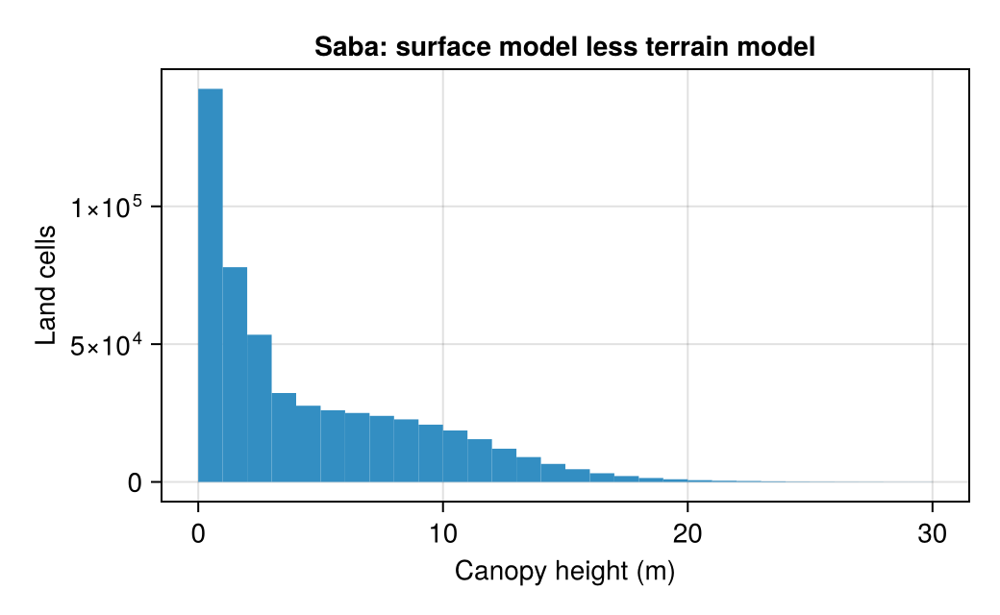
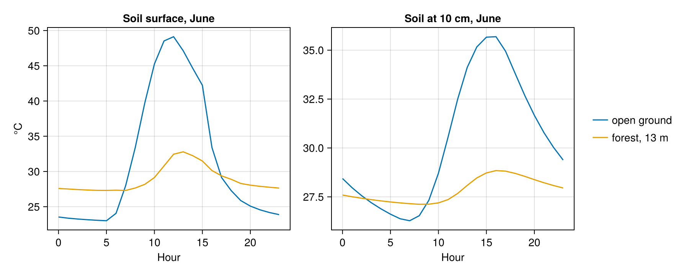
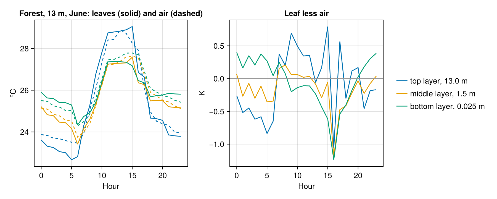

# Canopy on Saba

Microclimate.jl can solve the microclimate under a multilayer canopy: radiation through each leaf layer, wind and
air temperature within the canopy, and the temperature of the leaves, see its
[Canopy](https://biophysicalecology.github.io/Microclimate.jl/dev/manual/canopy) page. This tutorial takes the
height of the canopy from the island of [Terrain: Saba](saba.md), as SolarRadiation.jl's tutorial does in its last
section.

!!! note "Pre-rendered"
    A canopy run iterates the energy balance of every leaf layer and is slow. The figures were made by
    `docs/render/canopy.jl`.

## Canopy height from LiDAR

The LiDAR of Saba gives two models: a terrain model of the ground, and a surface model of the top of whatever
stands on it. Their difference is the height of the vegetation (and of buildings):

```julia
dsm = Raster(Downloads.download("https://github.com/Deltares/Geomorphometry.jl/releases/download/v0.6.0/saba_dsm.tif"))
canopy_height = clamp.(dsm .- dtm, 0.0, 30.0)
```



Half the island's land is under vegetation less than 2.8 m tall; a twentieth is under more than 13 m, the forest of
the upper slopes and gullies.

## One canopy per run

The canopy is part of the point model, a `MultilayerCanopy` in the `MicroModel`, with one height and one profile
of plant area. Its heights above ground must resolve the canopy. So a canopy that varies from cell to cell is, at
present, one run per class of canopy height. A height for each cell, read from a raster such as the one above, is
planned.

```julia
canopy = MultilayerCanopy(; canopy_height = 13.0u"m", plant_area_index, shortwave_model = TwoStreamRadiation())
micro_model = MicroModel(; depths, heights, canopy_model = canopy,
    soil_properties_model = example_soil_properties_model(),
    soil_hydraulic_model = example_soil_hydraulic_model(), snow_model = NoSnow())
model = MicroMapModel(; micro_model, dem_source = SRTM, weather_source = TerraClimate{Historical},
    output_layers = (LayerSpec(:soil_temperature, :soil), LayerSpec(:leaf_temperature, :canopy),
                     LayerSpec(:canopy_air_temperature, :canopy, :air_temperature)))
```

The `:canopy` output layers have a `canopy_layer` dimension, one value per leaf layer, see [Outputs](../manual/outputs.md).

## Under the canopy

Open ground and a 13 m forest, the island's tallest twentieth, on the upper slopes of Mount Scenery, on the
representative day of June, with TerraClimate forcing for 2000 as in [Terrain: Saba](saba.md):



Under the forest the soil surface peaks at about 33 °C, against 49 °C in the open, and at night stays near 27.5 °C,
where open ground falls to 23 °C: the canopy intercepts the sun by day and returns longwave radiation by night. At
10 cm the daily range shrinks from 9 K to under 2 K. The plant area index of the forest, 4, is assumed, not
measured; the colour-infrared photograph of SolarRadiation.jl's tutorial is one route to estimating it. The open
run, the first of the session and so including compilation, took 95 s here, and the forest 57 s.

## The leaves

The same forest run gives the temperature of the leaves in every layer, here the top, the middle and the bottom,
each against the air at its own height:



Each layer's leaves are in a heat balance, solved hour by hour with the air around them by
[HeatExchange.jl](https://biophysicalecology.github.io/HeatExchange.jl/dev), the package that does the same for
animals:

- **radiation in**: the shortwave the layer absorbs, from the two-stream model (`TwoStreamRadiation`), and the
  longwave from the sky, the layers above and below, and the ground (`LayeredRadiosityExchange`);
- **radiation out**: the leaves' own longwave emission, at their emissivity (0.97 by default);
- **convection**: the leaf is a flattened ellipsoid whose size comes from its length and width (`leaf_parameters`),
  narrowed by the leaf angle distribution (Campbell 1990), and HeatExchange.jl's correlations for free and forced
  convection give its heat transfer coefficient at the wind speed of the layer;
- **transpiration**: HeatExchange.jl's `evaporation`, through the stomatal conductance (`stomatal_model`) and with
  the humidity inside the leaf set by its water potential.

The leaf temperature that balances these is found by a linearised step around the previous estimate
(`LinearizedLeafTemperature`), repeated as the canopy's air temperature, humidity and wind are updated
(`PicardCanopyConvergence`). Leaves stay within about a degree of the air. At night the top layer, which sees the
sky, is up to a degree cooler than the air around it, while the lower layers are sheltered by those above. By day
the sunlit top layer runs up to 0.8 K warmer. The hour-to-hour jumps of the afternoon, up to a degree, are larger
than the weather explains, and are worth checking against the canopy iteration's convergence.
