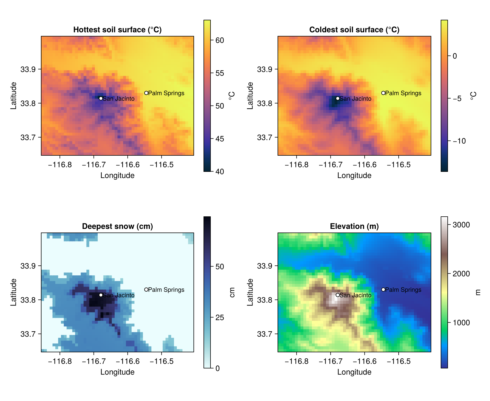
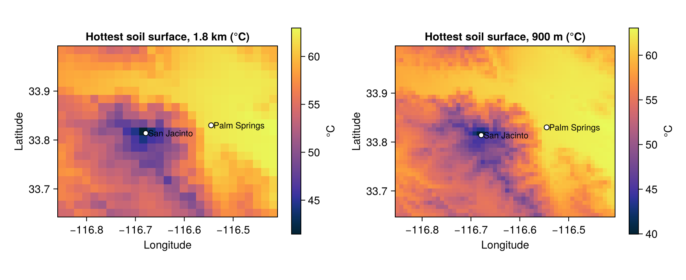
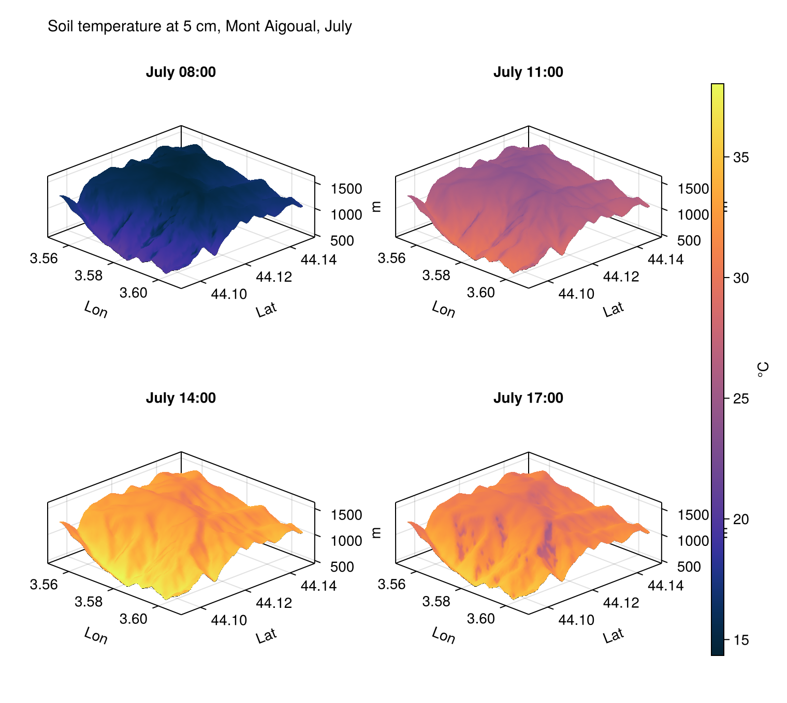
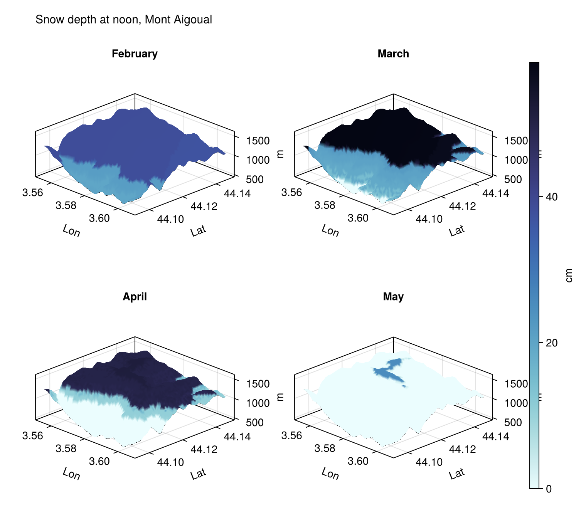

# Maps

A [`MicroRasterProblem`](@ref) solves every cell of a grid. [Get started](../get_started.md) runs southern
California on the 18 km grid of the CRU CL 2.0 climatology itself. This tutorial goes finer, over the desert and
mountain around Palm Springs, and then over Mont Aigoual, the summit of the Cévennes in southern France.

!!! note "Pre-rendered"
    These grids take minutes each, see [Performance](../manual/performance.md). The figures were made by
    `docs/render/maps.jl` and are not recomputed when the documentation is built.

## Palm Springs and Mount San Jacinto

Palm Springs lies on the floor of the Coachella Valley at 150 m. Mount San Jacinto rises to 3300 m 13 km to the
west. The grid is SRTM, aggregated from 90 m to about 900 m; the weather is the CRU CL 2.0 climatology, corrected
to the elevation of each cell:

```julia
using MicroclimateMapper, Microclimate, RasterDataSources, Rasters, Dates, Unitful
using Rasters.Extents: Extent

area = Extent(X = (-116.85, -116.40), Y = (33.65, 34.00))
srtm = read(crop(Raster(SRTM; extent = area, lazy = true); to = area, touches = true))
template = aggregate(mean, srtm, 10)                       # ~900 m
model = MicroMapModel(; micro_model, dem_source = SRTM, weather_source = CRUCL2,
    surface_albedo_source = 0.15, roughness_height_source = 0.004u"m")
output = solve(MicroRasterProblem(; model, area, template,
    dates = Date(2000, 1, 1):Day(1):Date(2000, 12, 31), soil_profile = example_soil_profile(depths),
    init = (; soil_moisture = fill(0.2, length(depths)), snow_depth = 0.0u"cm")))

hottest = maximum(output.soil_temperature[depth = 1]; dims = Ti)
deepest_snow = maximum(output.snow_depth; dims = Ti)
```



The hottest soil surface of the year reaches about 62 °C on the valley floor by Palm Springs and about 40 °C on the
summit; the coldest falls to about −13 °C on the summit and stays a few degrees above freezing in the valley. Snow lies up to about
70 cm deep on the peak and the ridge running south-east from it, and never in the valley.

The straight edges in the snow map are those of the 18 km cells of CRU CL 2.0. The weather of each fine cell is
that of the coarse cell it lies in, corrected for elevation, so wherever a threshold such as freezing is crossed,
the coarse cells' boundaries show. Interpolating the weather between coarse cells would remove them.

## The resolution lever

The same run on a grid twice as coarse, `aggregate(mean, srtm, 20)`, has a quarter of the cells:



The 18 km grid of [Get started](../get_started.md) put Palm Springs and the mountain in one cell. At 1.8 km the
valley floor and the mountain are separate, and at 900 m the ridges and canyons of its flanks appear. On this
machine the two took 304 and 428 s: loading the data and the terrain costs the same for both.

## Mont Aigoual

A 66 × 66 grid at SRTM's own resolution, about 90 m, over the summit of Mont Aigoual (1567 m), as in the
[MicroclimateTalk](https://rafaqz.github.io/MicroclimateTalk/talk.html):

```julia
area = Extent(X = (3.554, 3.608), Y = (44.095, 44.149))
output = solve(MicroRasterProblem(; model, area, template = SRTM, dates, soil_profile, init))
```

`template = SRTM` loads the DEM over the area and uses its own grid. Soil temperature at 5 cm through the
representative day of July, drawn over the terrain:



The morning sun warms the slopes facing east first. By the afternoon the pattern has reversed: the gullies and slopes
facing east are in their own shade and several degrees cooler than those facing the sun, while the summit plateau,
higher and exposed, warms less than the valley slopes below it. The run took 11 minutes on this machine.

and the snowpack as it melts:



The climatology's snowfall is the same over the whole of this small area, so through midwinter the snowpack is
nearly uniform, deeper only where the air is colder. The pattern comes with the melt, and it follows elevation:
the snowline climbs from about 630 m in March to 1000 m in April and 1500 m in May, when only the summit ridge
holds snow. By June it has gone. The snowline is a sharp contour because every cell has the same weather,
corrected for its elevation; slope and aspect change the melt little next to that.

The talk animates a year of daily snow over a wider area (a 100 × 100 grid aggregated from SRTM by 6) with the NCEP
reanalysis. That run takes about half an hour, and the NCEP binding needs fixing in the current versions of the
packages, so it is not reproduced here yet.

## Writing the output

Outputs carry units, which NetCDF cannot store. [`strip_to_canonical`](@ref) converts each layer to a standard unit
and strips it, after which Rasters.jl writes the stack:

```julia
write("aigoual.nc", strip_to_canonical(output))
```
