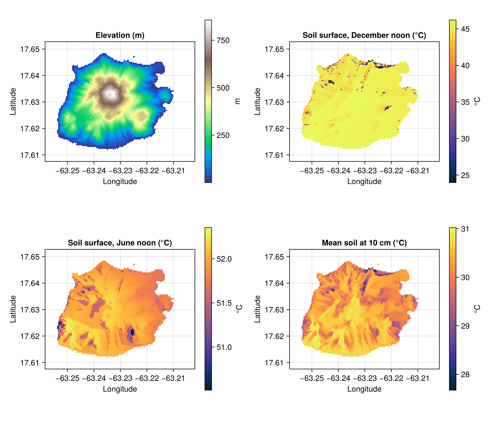
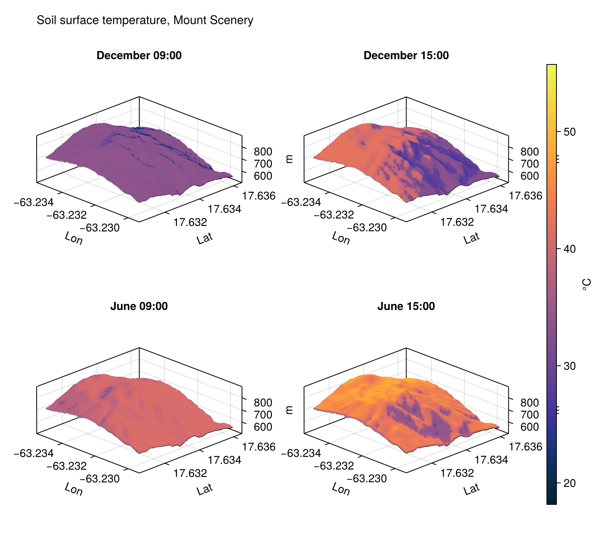
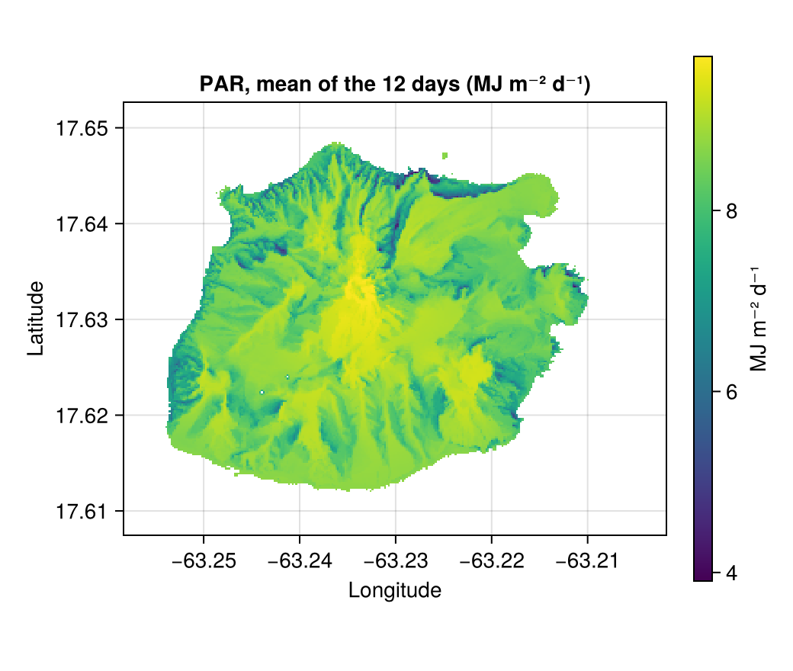

# Terrain: Saba

Saba is a volcanic island in the Caribbean, 13 km² and 887 m high. On it slope, aspect and the horizon change over
a few metres. SolarRadiation.jl's tutorial of the same name,
[Terrain: Saba](https://biophysicalecology.github.io/SolarRadiation.jl/dev/tutorials/saba), computes clear-sky
radiation on every cell of a LiDAR elevation model of the island, the one used in the documentation of
[Geomorphometry.jl](https://deltares.github.io/Geomorphometry.jl/stable/) (Pronk 2026). This tutorial carries the
same island through to soil temperature.

!!! note "Pre-rendered"
    A grid of thousands of cells takes several minutes to solve, see [Performance](../manual/performance.md), so the
    figures here were made by `docs/render/saba.jl` and are not recomputed when the documentation is built.

## The elevation model

The DEM is 5 m cells in metres on a local grid, with no geographic location. SolarRadiation.jl's tutorial gives
the island its latitude and longitude by hand; here the grid itself is moved to longitude and latitude about the
island's centre, so that it can be the `template` of a run and its DEM:

```julia
using MicroclimateMapper, Microclimate, Rasters, ArchGDAL, Dates, Unitful
using Downloads

file = Downloads.download("https://github.com/Deltares/Geomorphometry.jl/releases/download/v0.6.0/saba.tif")
dtm = Raster(file)
lat0, lon0 = 17.63, -63.23
xs, ys = lookup(dtm, X), lookup(dtm, Y)
step = 8                                                    # every 8th cell: 40 m
lon = lon0 .+ (xs[1:step:end] .- mean(xs)) ./ (111_320 * cosd(lat0))
lat = lat0 .+ (ys[1:step:end] .- mean(ys)) ./ 110_574
regular(v) = Sampled(range(first(v), last(v); length = length(v)); sampling = Intervals(Center()))
island = Raster(parent(dtm)[1:step:end, 1:step:end], (X(regular(lon)), Y(regular(lat))); crs = EPSG(4326))
```

The island is smaller than a cell of most weather data sets, and the cell of CRU CL 2.0 that covers it
is sea, with no data. TerraClimate's 4 km grid has two cells on the island, so it is the forcing here, for 2000:

```julia
model = MicroMapModel(; micro_model, dem_source = SRTM, weather_source = TerraClimate{Historical},
    surface_albedo_source = 0.15, roughness_height_source = 0.004u"m")
problem = MicroRasterProblem(; model, area = Extents.extent(island), template = island,
    dates = Date(2000, 1, 1):Day(1):Date(2000, 12, 31), soil_profile = example_soil_profile(depths),
    data = (; dem = coalesce.(island, 0.0)))
output = solve(problem)
```

`data = (; dem = …)` supplies the DEM directly, in place of `dem_source`. Slope, aspect and the 32 horizon angles of
every cell are computed from it, see [Terrain and atmosphere](../manual/terrain.md).

## The island



At noon in December the sun is 49° above the southern horizon: most of the island faces it well enough, and only
the steepest north-facing slopes and gullies, on the north coast above all, are much cooler. In June it is nearly
overhead, and the whole island is within a degree. The mean temperature at 10 cm, over the 12 days, shows the
pattern of ridges and gullies, through the radiation each receives over the year. TerraClimate is built on the
WorldClim grid, whose elevation could serve for the correction, but its binding does not yet declare one, so its air
temperature is not corrected for elevation here, see [Terrain and atmosphere](../manual/terrain.md#Elevation): the
differences come from radiation alone.

## Mount Scenery

The summit at 10 m, drawn over its terrain:



In the afternoon the slopes facing west, towards the sun, are warmest, and those facing east are in their own
shade. On this machine the island at 40 m (8334 land cells) took 25 minutes and the summit at 10 m (3721 cells)
8 minutes.

## Photosynthetic radiation

With `solar_only = true` the microclimate is not solved, only the radiation, here in the photosynthetic waveband,
every 20 m:

```julia
par = solve(MicroRasterProblem(; model = MicroMapModel(; micro_model, dem_source = SRTM, weather_source = TerraClimate{Historical},
        solar_only = true, solar_output_layers = (SOLAR_PAR,)), area, template = island_20m, dates,
    soil_profile = example_soil_profile(depths), data = (; dem = coalesce.(island_20m, 0.0))))
```



This is the clear-sky radiation of SolarRadiation.jl's tutorial, in one waveband, reached through this package's
terrain handling: highest on the summit, lowest in the north-facing gullies. Without the microclimate it took 35 s
for 33,338 cells. The vegetation of that tutorial's last section becomes a canopy in [Canopy on Saba](canopy.md).
