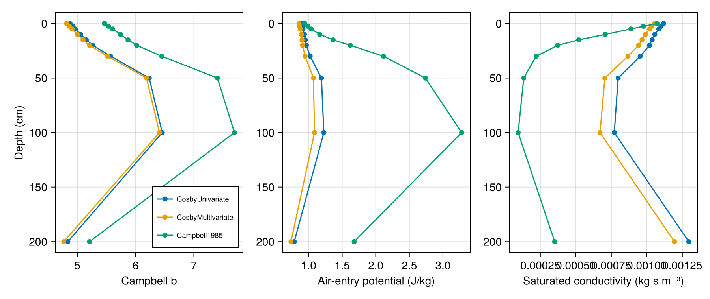
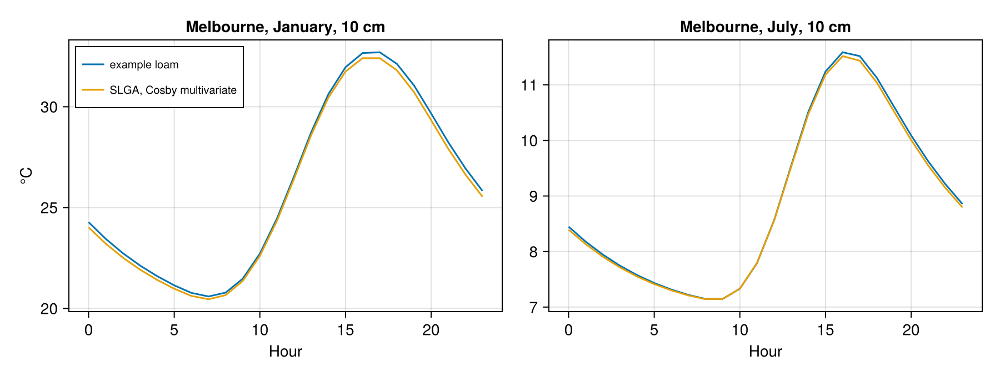

# Soils and land cover

The soil under a site sets how heat and water move through it. [`build_soil_profile`](@ref) builds a soil profile
from texture maps, see [Surfaces and soils](../manual/surfaces_soils.md). This tutorial builds one for Melbourne
from the Soil and Landscape Grid of Australia (SLGA), compares the three pedotransfer functions that turn texture
into hydraulic properties, and shows what the soil changes.

!!! note "Pre-rendered"
    The texture maps are large downloads. The figures were made by `docs/render/soils.jl`.

!!! warning "SoilGrids"
    `build_soil_profile(SoilGrids, …)`, for anywhere in the world, needs a version of RasterDataSources.jl with
    SoilGrids extents that is not yet in the versions this documentation was built with. Its use is the same as
    for SLGA.

## A profile from texture

```julia
using MicroclimateMapper, Microclimate, RasterDataSources, Unitful

depths = [0.0, 2.5, 5.0, 10.0, 15.0, 20.0, 30.0, 50.0, 100.0, 200.0]u"cm"
melbourne = build_soil_profile(SLGA, (144.96, -37.81); depths, pedotransfer_model = CosbyMultivariate())
melbourne.soil_profile    # for a problem's `soil_profile`
melbourne.campbell_b      # Campbell's b at each depth, also folded into the profile
```

SLGA gives clay, silt and sand fractions and bulk density at six depths to 2 m; they are interpolated onto the
model's depths.

## Pedotransfer functions



The two functions of Cosby et al. (1984) nearly agree. Campbell's (1985) gives a soil that holds water more
tightly and drains more slowly, more so with depth, where SLGA has more clay. At the surface:

| Pedotransfer | Campbell b | Air-entry potential (J/kg) | Saturated conductivity (kg s m⁻³) |
|:--|:--|:--|:--|
| `CosbyUnivariate` | 4.88 | 0.89 | 0.00112 |
| `CosbyMultivariate` | 4.82 | 0.86 | 0.00105 |
| `Campbell1985` | 5.47 | 0.94 | 0.00107 |

The field capacity (0.285) and wilting point (0.163) come from texture alone (Rab et al. 2011), the same for all
three.

## The effect on soil temperature

The example loam of Microclimate.jl against the SLGA profile at 10 cm, on the representative days of January and
July:



The difference is a few tenths of a degree. Here soil moisture is prescribed, so the hydraulic properties do not
enter; only the bulk density, through the thermal properties, does. With `DynamicSoilMoisture`, the hydraulic
properties set how fast rain soaks in and drains, and so how wet, and how conductive of heat, the soil is, see
Microclimate.jl's [Soil moisture](https://biophysicalecology.github.io/Microclimate.jl/dev/manual/soil_moisture).

## Land cover

Surface albedo and roughness can come from land cover, class by class, with `landcover_source =
EarthEnv{LandCover}` and `surface_albedo_source = nothing`, see
[Surfaces and soils](../manual/surfaces_soils.md#Albedo-and-roughness). The default values for each class are
placeholders at present, so this documentation sets albedo and roughness directly.
