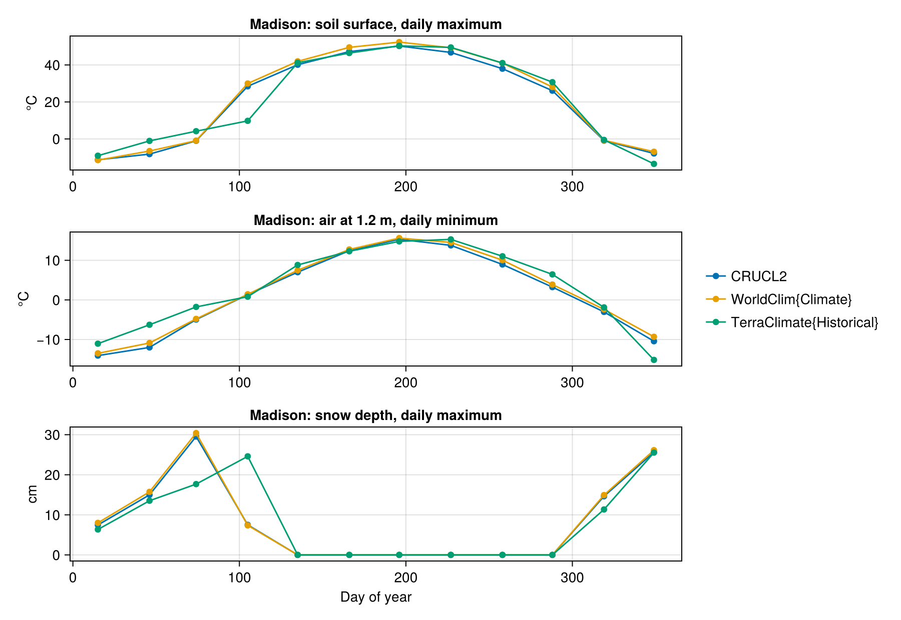
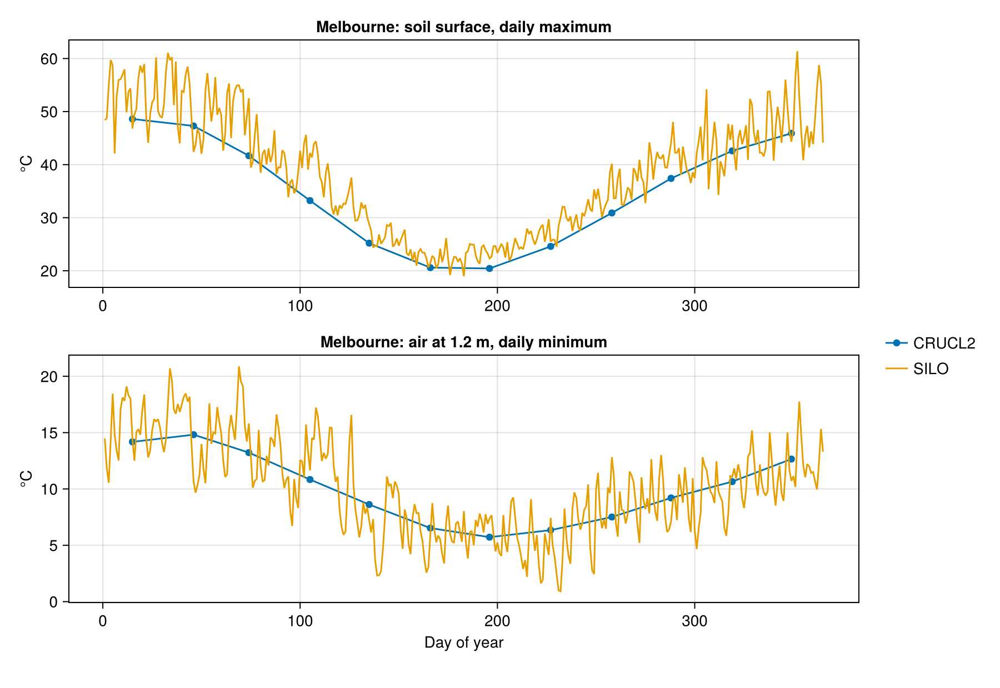

# Swapping data sets

The data set behind a run is one keyword, `weather_source`. This tutorial runs one model at two sites with nothing
changed but that keyword: Madison, Wisconsin, with three global data sets, and Melbourne, Victoria, the default site
of SolarRadiation.jl, with Australian ones. The [interactive app](../interactive.md) does the same at any point,
overlaying the data sets chosen to compare.

!!! note "Pre-rendered"
    Several of these data sets are large downloads, and SILO needs an email address, so the figures were made by
    `docs/render/swap_data.jl` from local copies.

```julia
using MicroclimateMapper, Microclimate, RasterDataSources, Rasters, Dates, Unitful

run_with(source, point, dates) = solve(MicroVectorProblem(;
    model = MicroMapModel(; micro_model, dem_source = SRTM, weather_source = source,
        soil_moisture_source = CPCSoil, surface_albedo_source = 0.15, roughness_height_source = 0.004u"m"),
    points = [point], dates, soil_profile = example_soil_profile(depths),
    init = (; soil_moisture = fill(0.2, length(depths)), snow_depth = 0.0u"cm")))

madison = (-89.40123, 43.07305)
outputs = [run_with(S, madison, Date(2000, 1, 1):Day(1):Date(2000, 12, 31))
           for S in (CRUCL2, WorldClim{Climate}, TerraClimate{Historical})]
```

## Madison



All three are monthly, so each gives 12 representative days, Microclimate.jl's mid-month days, plotted on those days. CRU CL 2.0
(1961–1990) and WorldClim (1970–2000) are climatologies, averages over decades, and nearly agree. TerraClimate is
the particular year 2000: its snowpack is shallower in March than the climatologies' but lasts into April, when
theirs has nearly gone, and the soil surface under it stays cool.

## Melbourne

```julia
melbourne = (144.96, -37.81)
outputs = [run_with(S, melbourne, Date(2025, 1, 1):Day(1):Date(2025, 12, 31)) for S in (CRUCL2, SILO)]
```



SILO is daily, so every day of 2025 is solved in turn, carrying the soil's heat from one day to the next. The
climatology traces the seasonal course through SILO's day-to-day weather, and misses its extremes: summer days with
the soil surface near 60 °C, cool changes, and winter nights near freezing. `BARRA` and `ERA5`, hourly, are swapped
in the same way, see the status note in [Forcing data sets](../manual/forcing_data.md).

## What each brought

| Site | Data set | Calendar | Within a day | Days solved | Time (s) |
|:--|:--|:--|:--|:--|:--|
| Madison | `CRUCL2` | monthly | daily extremes | 12 | 13 |
| Madison | `WorldClim{Climate}` | monthly | daily extremes | 12 | 30 |
| Madison | `TerraClimate{Historical}` | monthly | daily extremes | 12 | 25 |
| Melbourne | `CRUCL2` | monthly | daily extremes | 12 | 22 |
| Melbourne | `SILO` | daily | daily extremes | 365 | 45 |

Times include loading the data, from local copies, on the machine described in [Performance](../manual/performance.md),
after one untimed run to compile the model; the first run of a session takes a minute or two longer. Snow is
modelled in every run. The differences are mostly loading: the CRU CL 2.0 file is small, WorldClim and
TerraClimate are read from larger files, and SILO solves 365 days rather than 12.

## What differs

Only the forcing. The model, the soil, the surface and the code are the same in every run. Differences between the
lines are differences between the data sets: their period (a climatology or a year), their time step (monthly
means, daily extremes or hourly values), their grid, and how each variable was measured or modelled. Choosing among
them is a scientific decision, which this package makes cheap to test.
